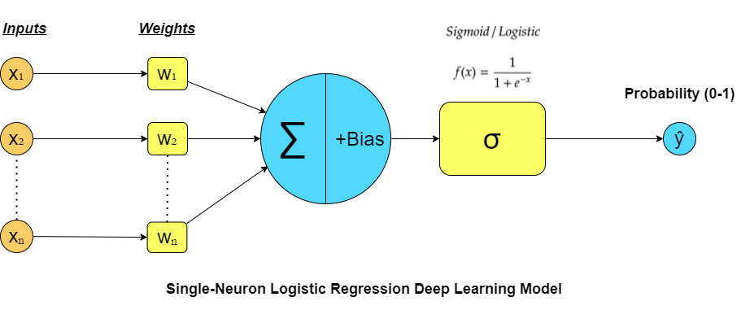
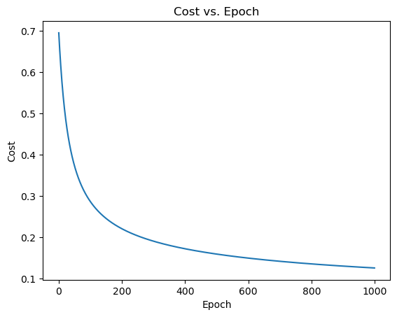

# One Neuron Model vs Sklearn on Breast Cancer Data

This project demonstrates and compares a manually implemented single-neuron (perceptron) model with scikit-learn's logistic regression, using the Breast Cancer dataset from scikit-learn.

## Project Structure
- **One_Neuron_Model _vs_Sklearn_Breast_Cancer_Data.ipynb**: Main Jupyter notebook containing all code, explanations, and visualizations.
- **assets/**: Folder containing images and visualizations used in the notebook, such as:
  - `LogisticRegresion_Perceptron.png`: Visual comparison of logistic regression and perceptron.
  - `costvsEpochs.png`: Cost vs. epochs plot.
  - `gorseller_perceptron.jpg`: Additional illustration.

## What You'll Learn
- How to implement a perceptron (single neuron) from scratch in Python.
- How to use scikit-learn's logistic regression for classification.
- How to preprocess and analyze the Breast Cancer dataset.
- How to visualize and compare model performance.

## Getting Started
1. **Clone the repository** and ensure you have the following dependencies:
   - Python 3.x
   - pandas
   - numpy
   - matplotlib
   - seaborn
   - scikit-learn
   - tensorflow (optional, for further experiments)

2. **Open the notebook**:
   - Launch Jupyter Notebook or JupyterLab.
   - Open `One_Neuron_Model_vs_Sklearn_Breast_Cancer_Data/One_Neuron_Model _vs_Sklearn_Breast_Cancer_Data.ipynb`.

3. **Run the cells** in order to reproduce the results and visualizations.

## Workflow Overview
- Initializing the weights and bias
- Identifying:
    - z (linear combination)
    - sigmoid function
    - forward and back propagation
- Manual model prediction and results (perceptron)
- Sklearn Logistic Regression prediction and results
- Evaluation with ROC curves, confusion matrices, and metrics (accuracy, recall, precision, F1, AUC)
- Visual and tabular comparison of both models

## Visuals
The notebook includes several images and plots, such as:
- 
- 
- Perceptron illustration
- ROC curves and confusion matrices

## Results Comparison

| Model                    | Accuracy | Recall (Sensitivity) | Precision | F1 Score | AUC  |
|--------------------------|----------|---------------------|-----------|----------|------|
| **Manual Perceptron**        | 0.97     | 1.00                | 0.96      | 0.98     | 0.97 |
| **Sklearn Logistic Reg.**    | 0.96     | 1.00                | 0.95      | 0.97     | 0.95 |

## License
This project is for educational purposes. Please cite the original sources if you use or adapt the code.

�� Folder: `01_Breast_Canser_DL/` 
▶️ [View Notebook](One_Neuron_Model_vs_Sklearn_Breast_Cancer_Data/One_Neuron_Model_vs_Sklearn_Breast_Cancer_Data.ipynb)

#### 📷 Sample Output:

---
