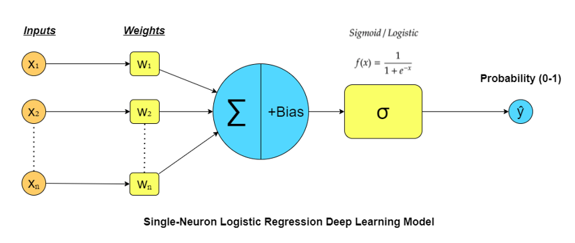

# One Neuron Model vs Sklearn on Breast Cancer Data

This project demonstrates and compares a manually implemented single-neuron (perceptron) model with scikit-learn's logistic regression, using the Breast Cancer dataset from scikit-learn.

## 🗂️ Project Structure
- 📓 **One_Neuron_Model _vs_Sklearn_Breast_Cancer_Data.ipynb**: Main Jupyter notebook containing all code, explanations, and visualizations.
- 🖼️ **assets/**: Folder containing images and visualizations used in the notebook, such as:
  - 🧮 `LogisticRegresion_Perceptron.png`: Visual comparison of logistic regression and perceptron.
  - 📈 `costvsEpochs.png`: Cost vs. epochs plot.
  - 🧑‍🏫 `gorseller_perceptron.jpg`: Additional illustration.

�� Folder: `01_Breast_Canser_DL/` 
▶️ [View Notebook](One_Neuron_Model_vs_Sklearn_Breast_Cancer_Data/One_Neuron_Model_vs_Sklearn_Breast_Cancer_Data.ipynb)

## 🎯 What You'll Learn
- 🧠 How to implement a perceptron (single neuron) from scratch in Python.
- 🤖 How to use scikit-learn's logistic regression for classification.
- 🧹 How to preprocess and analyze the Breast Cancer dataset.
- 📊 How to visualize and compare model performance.

## 🚀 Getting Started
1. **Clone the repository** and ensure you have the following dependencies:
   - 🐍 Python 3.x
   - 🐼 pandas
   - 🔢 numpy
   - 📊 matplotlib
   - 🌈 seaborn
   - 🤖 scikit-learn
   - 🧬 tensorflow (optional, for further experiments)

2. **Open the notebook**:
   - 💻 Launch Jupyter Notebook or JupyterLab.
   - 📓 Open `One_Neuron_Model_vs_Sklearn_Breast_Cancer_Data/One_Neuron_Model _vs_Sklearn_Breast_Cancer_Data.ipynb`.

3. **Run the cells** in order to reproduce the results and visualizations.

## 🧩 Workflow Overview
- ⚖️ Initializing the weights and bias
- ➕ Identifying:
    - 🧮 z (linear combination)
    - ➰ sigmoid function
    - 🔄 forward and back propagation
- 📝 Manual model prediction and results (perceptron)
- 🤖 Sklearn Logistic Regression prediction and results
- 🧪 Evaluation with ROC curves, confusion matrices, and metrics (accuracy, recall, precision, F1, AUC)
- 📊 Visual and tabular comparison of both models

## 🖼️ Visuals
The notebook includes several images and plots, such as:

-  
- 🧑‍🏫 Perceptron illustration

#### 📷 Sample Output:

- 📉 ROC curves and 🟦 confusion matrices
---

## 📋 Results Comparison

| Model                    | Accuracy | Recall (Sensitivity) | Precision | F1 Score | AUC  |
|--------------------------|----------|---------------------|-----------|----------|------|
| 📝 **Manual Perceptron**        | 0.97     | 1.00                | 0.96      | 0.98     | 0.97 |
| 🤖 **Sklearn Logistic Reg.**    | 0.96     | 1.00                | 0.95      | 0.97     | 0.95 |

## 📄 License
This project is for educational purposes. Please cite the original sources if you use or adapt the code.

